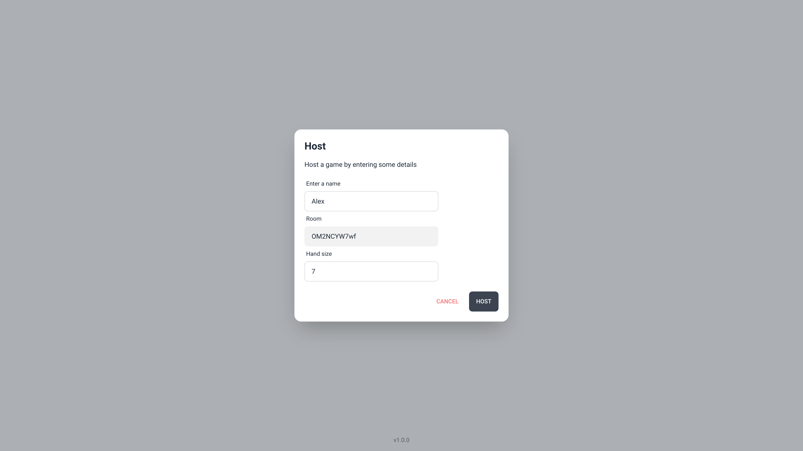

# [UNO](https://uno-web-4m6k.onrender.com)

Classic UNO card game implemented with React and Python using [Socket.IO](https://socket.io/) for realtime multiplayer functionality.

## 📷 Screenshots




## 💻 Development

**Server**

```
$ cd server
$ make start-redis
$ make dev
```

_Note: Make sure docker is running._

**Web**

```
$ cd web
$ pnpm install
$ pnpm run dev
```

## 📖 TODO

- [ ] Better game validation rules
- [ ] Implement game log
- [ ] Host can kick player from room
- [ ] Place chance logic
- [ ] Generate random player name
- [ ] Player can remove a card from hand
- [ ] Migrate to a message broker like NATS?
